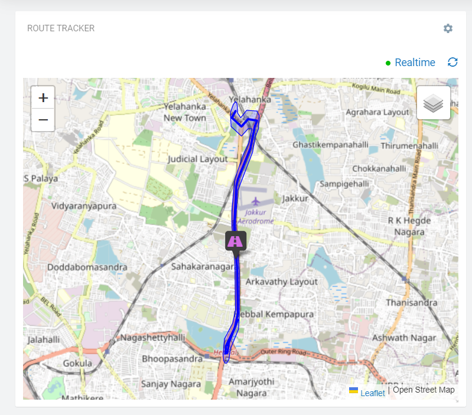
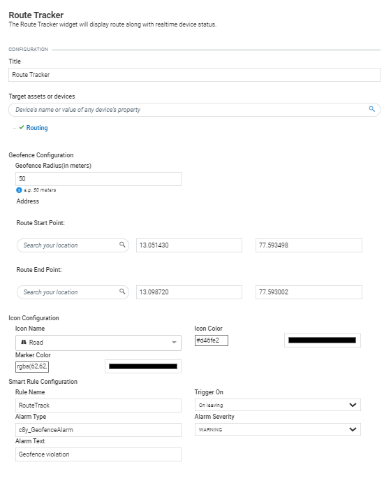

# Route Tracker Widget for Cumulocity 

  
This Route Tracker widget is the Cumulocity module federation plugin created using c8ycli. This plugin can be used in Application Builder or Cockpit.
The Route Tracker widget help you to display route, geofence along with realtime device status and also one can enable the smart rule which gets trigged when smart rule violation happens.

### Please choose Route Tracker release based on Cumulocity/Application builder version:

|APPLICATION BUILDER&nbsp; |&nbsp; CUMULOCITY &nbsp;|&nbsp; ROUTE TRACKER WIDGET&nbsp; |
|--------------------|------------|----------------------|
| 2.x.x | >= 1016.x.x| 1.x.x                | 

  
## Representation

  

## Prerequisite
   Cumulocity c8ycli >=1016.x.x
   
   
## Installation

### Runtime Widget Deployment?

* This widget support runtime deployment. Download [Runtime Binary](https://github.com/SoftwareAG/cumulocity-route-tracker-plugin/releases/download/1.0.1/sag-ps-pkg-route-tracker-runtime-widget-1.0.1.zip) and install via Administrations --> Ecosystems --> Applications --> Packages.

## QuickStart
This guide will teach you how to add widget in your existing or new dashboard.

1. Open you application from App Switcher

2. Add new dashboard or navigate to existing dashboard

3. Click `Add Widget`

4. Search for `Route Tracker`

5. Select `Target Assets or Devices`

7. Click `Save`

Congratulations! Smart Map is configured.

  
## User Guide

1. Takes device name, geofence radius, start and end address/latitude and longitude, icon name color, marker color and smart rule configuration as input.

2. If configured Smart rule with provided name doesnt exist then a new rule get created and if the rule with provided name exists then it updates the existing rule.
**Note** Make sure for different devices and for differnt configuration a uinique smart rule name need to be provided else it overrides if the rule with name exists.

To check the smart rules please navigate to Application Switcher -> Cockpit -> Configuration -> Global smart rule

------------------------------

This widget is provided as-is and without warranty or support. They do not constitute part of the Software AG product suite. Users are free to use, fork and modify them, subject to the license agreement. While Software AG welcomes contributions, we cannot guarantee to include every contribution in the master project.

_____________________

For more information you can Ask a Question in the [TECHcommunity Forums](https://tech.forums.softwareag.com/tags/c/forum/1/Cumulocity-IoT).

You can find additional information in the [Software AG TECHcommunity](https://tech.forums.softwareag.com/tag/Cumulocity-IoT).
